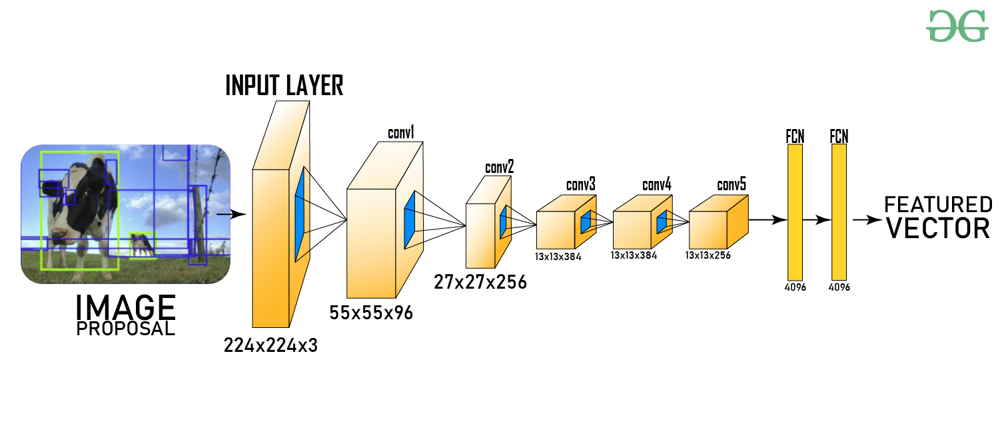
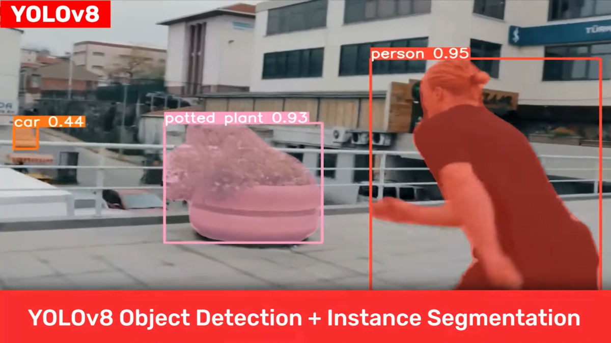
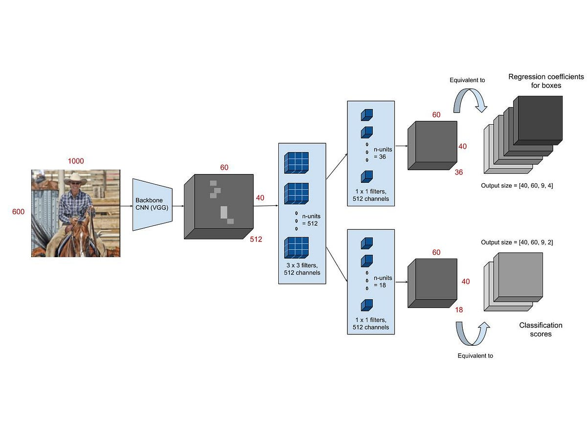
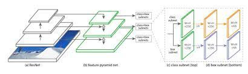

# Object Detection
![TensorFlow][tensorflow-badge]
![PyTorch][pytorch-badge]

## Pengenalan dan dasar teori 

### A. Pengantar Object Detection

![Object Detection][img1]

Deteksi objek (object detection) adalah teknologi yang memungkinkan sistem untuk mengenali dan mengidentifikasi objek dalam gambar atau video. Dalam machine learning, deteksi objek dapat dicapai dengan menggunakan algoritma deep learning yang dapat mempelajari fitur-fitur objek dalam gambar dan membedakannya dari objek lainnya.

Pada dasarnya, deteksi objek melibatkan empat tahap: pendaftaran objek, pelatihan model, deteksi objek, dan klasifikasi objek.

Pada tahap pendaftaran objek, gambar-gambar yang berisi objek-objek yang ingin dideteksi diambil dan dilabeli untuk mengidentifikasi objek tersebut.

Pada tahap pelatihan model, algoritma deep learning akan dipelajari menggunakan data gambar yang telah dilabeli. Algoritma akan belajar untuk mengidentifikasi objek-objek tertentu dalam gambar dan membedakannya dari objek-objek lainnya.

Pada tahap deteksi objek, gambar yang diambil akan diproses oleh algoritma deep learning untuk mendeteksi objek yang telah dilatih dalam model.

Pada tahap klasifikasi objek, objek-objek yang terdeteksi kemudian diklasifikasikan ke dalam kategori-kategori yang telah ditentukan sebelumnya, seperti mobil, manusia, atau hewan.

Deteksi objek digunakan dalam berbagai aplikasi, seperti pengawasan lalu lintas, deteksi benda asing pada industri makanan dan minuman, serta pengenalan citra pada robotika dan kendaraan otonom. Namun, teknologi ini juga memiliki tantangan, seperti masalah akurasi deteksi dan kecepatan pemrosesan yang harus ditingkatkan secara terus-menerus.

### B. Metode-metode pada pengembangan Object Detection

Ada beberapa metode yang umum digunakan dalam object detection, antara lain yaitu:

1. Region-based Convolutional Neural Networks (R-CNN): R-CNN adalah pendekatan yang populer dalam object detection. Pendekatan ini membagi gambar menjadi beberapa wilayah dan setiap wilayah dianalisis menggunakan algoritma deep learning yang terpisah untuk mengenali objek. Metode ini kemudian menggabungkan hasil dari semua wilayah untuk menghasilkan lokasi dan label objek.

  

2. Single Shot Detector (SSD): SSD adalah metode yang memungkinkan objek untuk dideteksi dalam satu jangkauan dengan model jaringan tunggal. Pendekatan ini menggabungkan tiga jaringan convolutional network dengan resolusi yang berbeda untuk mendeteksi objek pada berbagai skala.

  

3. You Only Look Once (YOLO): YOLO adalah metode object detection real-time yang membagi gambar menjadi beberapa grid cell dan memprediksi lokasi dan label objek untuk setiap grid cell. Pendekatan ini menggabungkan deteksi objek dan klasifikasi dalam satu jaringan neural, sehingga sangat efisien dan cepat.

  

4. Faster R-CNN: Faster R-CNN adalah pengembangan dari R-CNN yang menggunakan jaringan neural untuk mempercepat proses proposal wilayah. Pendekatan ini menghasilkan kemampuan deteksi yang lebih cepat dan lebih akurat.

  

5. RetinaNet: RetinaNet adalah metode yang menggunakan struktur jaringan neural yang mirip dengan SSD. Namun, pendekatan ini menggunakan struktur khusus yang memungkinkan model untuk mengidentifikasi objek pada skala yang berbeda dengan lebih akurat.

  

Semua metode di atas dapat diimplementasikan dengan menggunakan berbagai framework machine learning seperti TensorFlow, PyTorch, atau Caffe. Metode object detection yang dipilih tergantung pada aplikasi dan data yang digunakan.

## Data Preparation
Data preparation adalah tahap penting dalam machine learning dan deep learning, di mana data disiapkan dan diproses sebelum dimasukkan ke dalam model. Tujuan dari data preparation adalah untuk menghasilkan dataset yang berkualitas tinggi dan representatif yang dapat meningkatkan performa dan akurasi model.

Beberapa tahap dalam data preparation meliputi:

1. **Pengumpulan data**: Data dapat diperoleh dari berbagai sumber, seperti internet, basis data, atau sensor.

2. **Preprocessing data**: Data perlu dipreprocessing terlebih dahulu sebelum dimasukkan ke dalam model. Proses preprocessing dapat meliputi penghapusan data yang tidak relevan, penyeimbangan dataset, normalisasi data, pengisian data yang hilang (imputation), dan transformasi data (misalnya, encoding).

3. **Pemisahan dataset**: Dataset perlu dipisahkan menjadi dataset pelatihan, dataset validasi, dan dataset pengujian. Dataset pelatihan digunakan untuk melatih model, dataset validasi digunakan untuk mengukur kinerja model saat diuji dengan data yang belum pernah dilihat sebelumnya, dan dataset pengujian digunakan untuk mengevaluasi kinerja akhir model.

4. **Augmentasi data**: Augmentasi data adalah proses pembuatan data baru dengan memodifikasi data asli. Augmentasi data dapat membantu meningkatkan keanekaragaman dataset dan mengurangi overfitting. Contoh augmentasi data termasuk flipping, zooming, cropping, dan rotasi.

5. **Pengkodean label**: Data yang digunakan untuk pemodelan deep learning perlu memiliki label yang sesuai untuk memastikan model dapat membedakan antara kelas yang berbeda. Contoh pengkodean label termasuk one-hot encoding dan label encoding.

Data preparation membutuhkan waktu dan sumber daya yang cukup untuk diproses dengan benar, tetapi sangat penting untuk memastikan kualitas dan performa model yang baik.

<!-- REF -->
[tensorflow-badge]: https://img.shields.io/badge/TensorFlow-%23FF6F00.svg?style=for-the-badge&logo=TensorFlow&logoColor=white
[pytorch-badge]: https://img.shields.io/badge/PyTorch-%23EE4C2C.svg?style=for-the-badge&logo=PyTorch&logoColor=white

[img1]: docs/assets/object_detection_algo.jpg
[img2]: docs/assets/rcnn.jpeg
